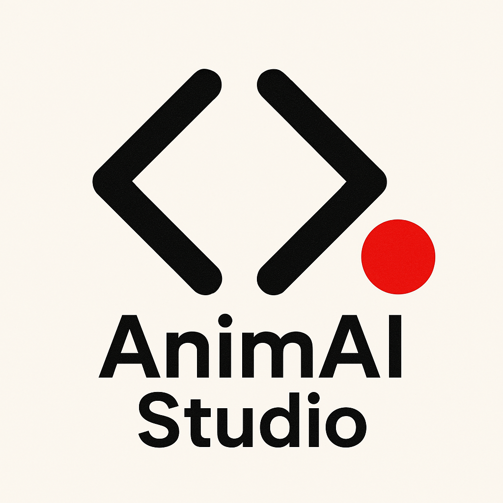

AnimAI Studio v1.0

AnimAI Studio es una herramienta de producción automatizada de videos animados a partir de audio y texto. Diseñada para creadores de contenido, educadores, storytellers y emprendedores, transforma tus ideas en videos de alto impacto de forma simple, rápida y con estilo profesional.

----------------------------

¿QUÉ HACE?

- Genera videos animados automáticamente a partir de un audio o guión.
- Detecta el tono emocional del contenido para adaptar el estilo visual.
- Añade subtítulos sincronizados (con Whisper o modo simple).
- Inserta personajes con reacciones y expresiones según el contenido.
- Aplica efectos visuales dinámicos: zoom, paneos, glitch, desenfoque y más.
- Genera metadatos listos para publicar en redes (título, descripción, hashtags).
- Incluye un panel visual de control para gestionar proyectos.

----------------------------

¿QUÉ INCLUYE ESTA VERSIÓN?

- Código listo para producción.
- Archivos de ejemplo: audio, imágenes, guión y música por tono.
- Interfaz de usuario con Tkinter (no necesitas saber programación).
- Panel de edición de estilos visuales y reacciones.
- Herramienta automática de validación del sistema.

----------------------------

REQUISITOS

- Python 3.8 o superior
- Dependencias: MoviePy, Whisper, Pillow, Pydub, Tkinter

Instalación rápida:
pip install -r requirements.txt

----------------------------

¿CÓMO LO USO?

1. Ejecutá el panel principal:
   python control_panel.py

2. Seleccioná una fecha o carpeta de proyecto.

3. Visualizá escenas, ajustá estilos y lanzá la producción del video.

4. Copiá el título y descripción listos para YouTube o redes.

5. ¡Listo! El video se guarda en la carpeta output/

----------------------------

PERSONALIZACIÓN

- Podés editar el estilo visual de cada tono desde la interfaz.
- Podés añadir tus propias palabras de reacción del personaje en el panel.
- Podés agregar música, personajes, fondos y efectos personalizados.

----------------------------

ESTRUCTURA DEL PROYECTO

AnimAI-Studio/
├── assets/            ← Imágenes, música y recursos visuales
├── config/            ← Configuración visual y lógica editable
├── output/            ← Videos generados
├── scripts/           ← Tus proyectos diarios
├── utils/             ← Lógica interna del sistema
├── control_panel.py   ← Panel principal (GUI)
├── main.py            ← Ejecución directa de un proyecto
├── daily_runner.py    ← Procesamiento por lotes
├── README.md

----------------------------

LICENCIA Y USO

Esta herramienta es de uso libre y está pensada para fines educativos, creativos y comerciales. Podés modificarla, personalizarla y escalarla. Se agradece mantener la referencia al proyecto original si la usás como base para productos derivados.

----------------------------

AUTOR

Desarrollado por Joel Villarroel (Argentina), bajo el concepto creativo de <joexe>, con el objetivo de empoderar a creadores de contenido a monetizar su talento con herramientas accesibles e inteligentes.

----------------------------

¿QUERÉS MONETIZAR CON ESTA HERRAMIENTA?

Podés:
- Crear contenido diario para redes y automatizarlo.
- Vender historias animadas por encargo.
- Generar contenido educativo con voz y animaciones.
- Crear canales de YouTube sin depender de software de edición caro.

----------------------------

¿TODO LISTO?

Ejecutá:
python utils/validate_system.py

Y asegurate de que todo está OK antes de producir.

----------------------------

CONTACTO / SOPORTE

¿Consultas? ¿Ideas? ¿Quisieras contratarme o colaborar?
Escribime a: joexe4@gmail.com
O seguime en redes: IG: joel_villarroel

¡Gracias por usar AnimAI Studio! 🎥✨

